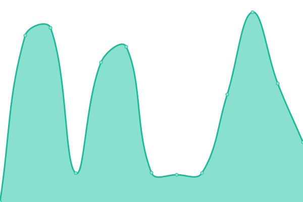

# [📈 Текущее состояние](https://up.zaitsv.dev): <!--live status--> **🟧 Partial outage**

This repository contains the open-source uptime monitor and status page for [WEBZaytsev](https://webzaytsev.ru), powered by [Upptime](https://github.com/upptime/upptime).

With [Upptime](https://upptime.js.org), you can get your own unlimited and free uptime monitor and status page, powered entirely by a GitHub repository. We use [Issues](https://github.com/WEBzaytsev/upptime/issues) as incident reports, [Actions](https://github.com/WEBzaytsev/upptime/actions) as uptime monitors, and [Pages](https://up.zaitsv.dev) for the status page.

## [📈 Live Status](https://demo.upptime.js.org): <!--live status--> **🟧 Partial outage**

<!--start: status pages-->
<!-- This summary is generated by Upptime (https://github.com/upptime/upptime) -->
<!-- Do not edit this manually, your changes will be overwritten -->
<!-- prettier-ignore -->
| URL | Status | History | Response Time | Uptime |
| --- | ------ | ------- | ------------- | ------ |
|  [Main site](https://webzaytsev.ru) | Работает | [main-site.yml](https://github.com/WEBzaytsev/upptime/commits/HEAD/history/main-site.yml) | 

 3643мс
     
 | 

<a href="https://up.zaitsv.dev/history/main-site">100.00%</a>
    

|  [Журнал zigmund.online](https://zigmund.online/journal) | Не работает | [zhurnal-zigmund-online.yml](https://github.com/WEBzaytsev/upptime/commits/HEAD/history/zhurnal-zigmund-online.yml) | 

 0мс
     
 | 

<a href="https://up.zaitsv.dev/history/zhurnal-zigmund-online">0.00%</a>
    

|  [Штольцман и Кац](https://katz.ru) | Работает | [shtolczman-i-kacz.yml](https://github.com/WEBzaytsev/upptime/commits/HEAD/history/shtolczman-i-kacz.yml) | 

 4326мс
     
 | 

<a href="https://up.zaitsv.dev/history/shtolczman-i-kacz">100.00%</a>
    

|  [КондиPRO](https://bestsurprise.ru) | Работает | [kondi-pro.yml](https://github.com/WEBzaytsev/upptime/commits/HEAD/history/kondi-pro.yml) | 

 1656мс
     
 | 

<a href="https://up.zaitsv.dev/history/kondi-pro">100.00%</a>
    

|  [HorseSmart](https://horsesmart.store) | Работает | [horse-smart.yml](https://github.com/WEBzaytsev/upptime/commits/HEAD/history/horse-smart.yml) | 

 2385мс
     
 | 

<a href="https://up.zaitsv.dev/history/horse-smart">99.83%</a>
    

|  VPN HorseSmart | Не работает | [vpn-horse-smart.yml](https://github.com/WEBzaytsev/upptime/commits/HEAD/history/vpn-horse-smart.yml) | 

 0мс
     
 | 

<a href="https://up.zaitsv.dev/history/vpn-horse-smart">0.00%</a>
    

|  GIT RoyalSoft | Работает | [git-royal-soft.yml](https://github.com/WEBzaytsev/upptime/commits/HEAD/history/git-royal-soft.yml) | 

 1391мс
     
 | 

<a href="https://up.zaitsv.dev/history/git-royal-soft">99.37%</a>
    

|  Vaultwarden RoyalSoft | Работает | [vaultwarden-royal-soft.yml](https://github.com/WEBzaytsev/upptime/commits/HEAD/history/vaultwarden-royal-soft.yml) | 

 1419мс
     
 | 

<a href="https://up.zaitsv.dev/history/vaultwarden-royal-soft">99.20%</a>
    

|  [Expotion RnD](https://expotion.tech) | Работает | [expotion-rn-d.yml](https://github.com/WEBzaytsev/upptime/commits/HEAD/history/expotion-rn-d.yml) | 

 2011мс
     
 | 

<a href="https://up.zaitsv.dev/history/expotion-rn-d">100.00%</a>
    

<!--end: status pages-->

[**Visit our status website →**](https://up.zaitsv.dev)

## 📄 License

- Powered by: [Upptime](https://github.com/upptime/upptime)
- Code: [MIT](./LICENSE) © [Anand Chowdhary](https://anandchowdhary.com), supported by [Pabio](https://pabio.com)
- Data in the `./history` directory: [Open Database License](https://opendatacommons.org/licenses/odbl/1-0/)
